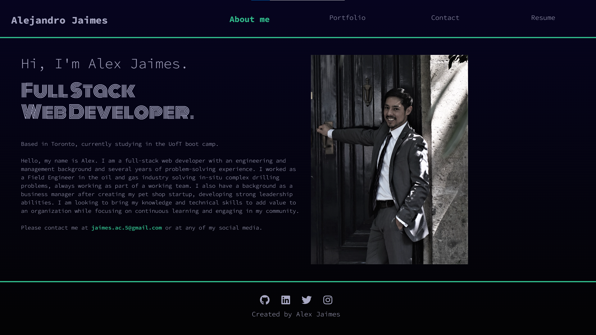
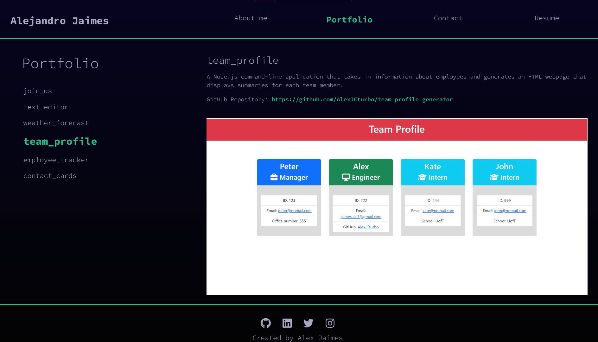
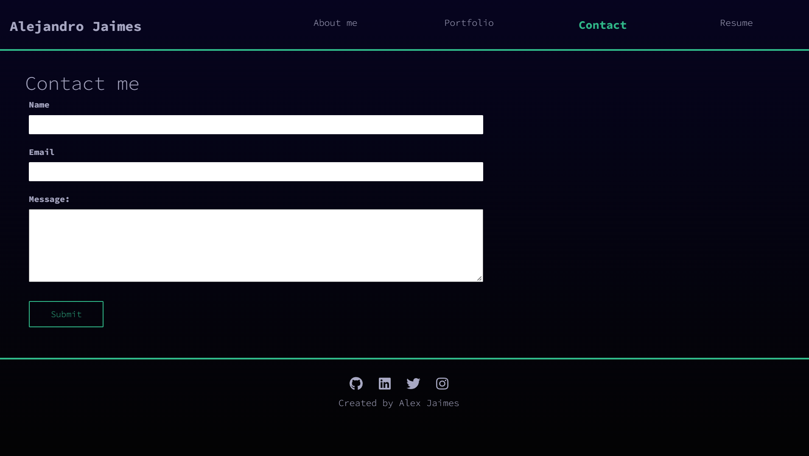
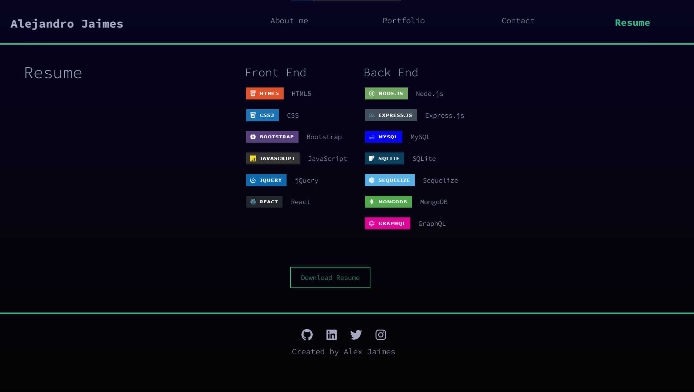

# Employee Tracker

## Table of Contents

- [Project Description](#Project-Description)
- [User Story](#User-Story)
- [Links](#Links)
- [Screen Captures](#Screen-Captures)
- [Technologies](#Technologies)
- [Questions](#Questions)
- [License](#License)

## Project Description
Welcome to my portfolio repository. I created this portfolio with React to make it a single-page application. I included some of the most relevant projects that I have developed using the different technologies I have learnt during my training in the UofT boot camp.
###### [Back to Index](#Table-of-Contents)

## User Story

```
AS A young web developer looking to start my career in the tech industry
I WANT to showcase my React portfolio with relevant work samples
SO THAT I can demonstrate to potential employers my qualifications for job posts
```
###### [Back to Index](#Table-of-Contents)

## Links
- [Deployed Application](http://AlexJCturbo.github.io/react-portfolio)
###### [Back to Index](#Table-of-Contents)

## Screen Captures







###### [Back to Index](#Table-of-Contents)

## Technologies


###### [Back to Index](#Table-of-Contents)

## Questions
Please, feel free to get in touch to discuss any inquiries or suggestions for the project. I will be happy to connect with you!
###### [Back to Index](#Table-of-Contents)

## License
MIT License

Copyright (c) 2022 Alejandro Jaimes

Permission is hereby granted, free of charge, to any person obtaining a copy of this software and associated documentation files (the "Software"), to deal in the Software without restriction, including without limitation the rights to use copy, modify, merge, publish, distribute, sublicense, and/or sell copies of the Software, and to permit persons to whom the Software is furnished to do so, subject to the following conditions:

The above copyright notice and this permission notice shall be included in all copies or substantial portions of the Software.

THE SOFTWARE IS PROVIDED "AS IS", WITHOUT WARRANTY OF ANY KIND, EXPRESS OR IMPLIED, INCLUDING BUT NOT LIMITED TO THE WARRANTIES OF MERCHANTABILITY, FITNESS FOR A PARTICULAR PURPOSE AND NONINFRINGEMENT. IN NO EVENT SHALL THE AUTHORS OR COPYRIGHT HOLDERS BE LIABLE FOR ANY CLAIM, DAMAGES OR OTHER LIABILITY, WHETHER IN AN ACTION OF CONTRACT, TORT OR OTHERWISE, ARISING FROM, OUT OF OR IN CONNECTION WITH THE SOFTWARE OR THE USE OR OTHER DEALINGS IN THE SOFTWARE.
###### [Back to Index](#Table-of-Contents)